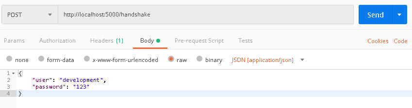
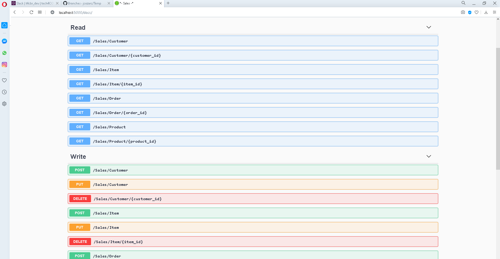
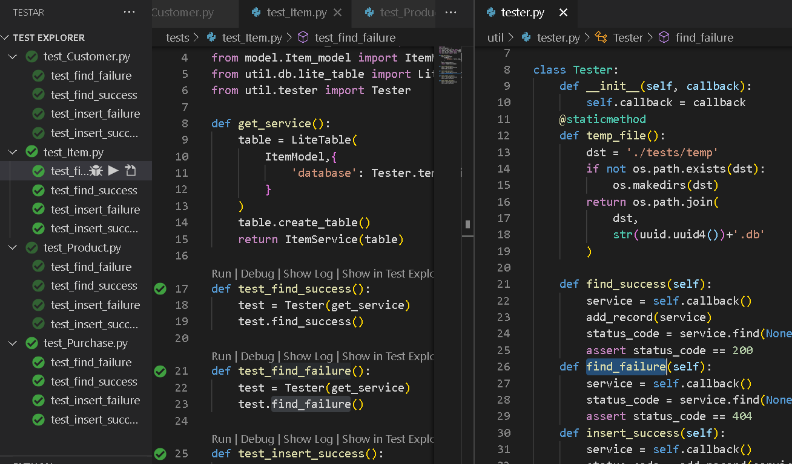

# Desafio Loja virtual

O projeto _Sales_ é um desafio para funções básicas de um back-end Python de loja virtual.
---

### Rotas
* `/handshake` Ao fazer o seguinte POST...

...você recebe um token para futuras transações com a API.
    * Você pode configurar usuário e senha mais seguros
        em **/resource/user_controller.py**
    
* `/docs` Traz a documentação _Swagger_ com todos os verbos REST disponíveis para a API e exemplos funcionais (Recomendo remover a autenticação JWT se quiser usar diretamente no browser, ou utilizar algum programa como _POSTMAN_...)


* `/Sales/Customer` Pode ser usado para trazer vários clientes (onde você pode passar uma query com os nomes dos campos, p.ex.: `...?name=CUSTOMERXYZ`)
    * você pode também passar um `.../<id>`
    para operações que exigem um registro único (consulta por campo chave ou exclusão)
    * Em caso de **POST** ou **PUT** é preciso passar o JSON adequado no _body_ da requisição (o formato do JSON estará na documentação Swagger).

* `/Sales/Product` Funciona igual _/Sales/Customer_ só que para **Produtos**.

* `/Sales/Purchase` Funciona igual _/Sales/Customer_ só que para **Pedidos**.

* `/Sales/Item` Funciona igual _/Sales/Customer_ só que para **Itens de pedido**.

---

### Configuração de banco de dados

* Esta API pode rodar tanto com MySql como com Sqlite:
  - para usar com MySql abra o arquivo `/backend/service/db_connection.py` e (des)comente as linhas referentes à conexão desejada.
* Variáveis de ambiente (para usar com MySql)
  - SALES_USER
  - SALES_HOST
  - SALES_PASSWORD

---
### Testes unitários
As seguintes situações foram testadas para verificar se cada serviço está funcionando conforme esperado:


* Falha na busca: Deve retornar o status 404 quando não encontra o registro
* Sucesso na busca: Retorna o registro relacionado ao campo chave usado na busca;
* Falha de inclusão: Não permite registro com campos inválidos;
* Sucesso na inclusão: Simula a gravação de um registro e retorna sem erros;

---
### Dados gerados

Os dados abaixo são resultado dos testes com a API.
A gravação dos registros pode ocorrer de várias formas:
* Gravar um Cliente, gravar um Produto e então Gravar um Pedido;
* Gravar um Pedido com um Cliente dentro e depois grava os itens desse pedido;
* Gravar tudo num único JSON representando todos os relacionamentos:

```
{
  "id": 2,
  "purchase": {
    "customer": {
      "id": 1,
      "name": "José da Silva"
    },
    "id": 1,
    "sale_date": "2020-11-18"
  },
  "product": {
    "name": "Produto Xyz",
    "id": 3,
    "value": 39.74
  },
  "quantity": 2
}
```
